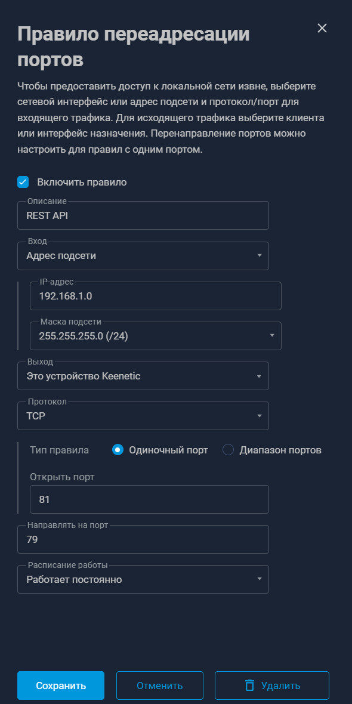

# PolicyTraySwitch

[](https://github.com/ivn-git/PolicyTraySwitch/actions/workflows/release.yml)
[](https://github.com/ivn-git/PolicyTraySwitch/releases/latest)
[](https://github.com/ivn-git/PolicyTraySwitch)

Удобный инструмент для быстрого переключения политик и управления конфигурациями прямо из системного трея Windows.

---

## ⚠️ Заметка для пользователей Windows (SmartScreen)

При первом запуске скачанного установщика `PolicyTraySwitch_Setup.exe` операционная система Windows может показать синее окно с предупреждением: **«Защитник Windows SmartScreen предотвратил запуск неопознанного приложения»**. 

### Почему это происходит?
Это стандартное поведение Windows для всех новых независимых программ с открытым исходным кодом. Чтобы это окно не появлялось сразу, разработчик должен ежегодно покупать дорогой коммерческий цифровой сертификат (от $300/год), что не имеет практического смысла для бесплатного open-source проекта.

### Как запустить программу?
1. В синем окне предупреждения нажмите на ссылку **«Подробнее»** (More info) в левом верхнем углу текста.
2. В правом нижнем углу появится скрытая кнопка **«Выполнить в любом случае»** (Run anyway) — нажмите её. 
3. Как только приложение скачают первые 30–50 пользователей, алгоритмы Microsoft автоматически занесут его в список безопасных, и это предупреждение исчезнет для всех остальных.

### 🛡️ Прозрачность и безопасность
* **Открытый код:** Вы можете лично изучить каждую строчку исходного кода в этом репозитории.
* **Чистая сборка:** Исполняемый файл собирается автоматически прямо на серверах GitHub (вкладка **Actions**) из исходного кода, который вы видите. Никакие скрытые изменения или сторонние файлы в релиз попасть не могут.
* **Автоматический аудит:** Каждое обновление кода проверяется встроенным сканером безопасности **GitHub CodeQL Analysis v4** на наличие уязвимостей и багов.

---

## 🚀 Установка и запуск

1. Перейдите в раздел [Releases](https://github.com/ivn-git/PolicyTraySwitch/releases/latest).
2. Скачайте последний доступный файл `PolicyTraySwitch_Setup.exe`.
3. Запустите установщик и следуйте инструкциям на экране.
   * *Примечание:* Также вы можете скачать портативную версию (PolicyTraySwitch_Portable.zip), распаковать и запускать на ПК
4. **Первый запуск приложения:**
   * Программа автоматически попытается определить IP-адрес шлюза вашего роутера. При успешном поиске она подставит этот IP, установит порт `81` (подробнее о настройке портов роутера читайте ниже), а также определит MAC-адрес сетевого интерфейса ПК, через который выполнено подключение.
   * После этого приложение загрузит все имеющиеся политики из роутера. Вы сможете найти их на вкладке **«Переключатели политик»**. Здесь доступна сортировка и редактирование названий переключателей (это локальные настройки приложения, они не влияют на конфигурацию самого роутера).
   * Если автоматический поиск завершится неудачно, вы всегда можете вручную указать правильные данные в полях **«URL роутера:порт»** и **«MAC адрес устройства»**.


## ⚙️ Важное примечание по настройке роутера

Программа работает напрямую через REST API роутера без авторизации. Для корректной работы перед запуском приложения вам необходимо настроить переадресацию портов, как показано на скриншоте ниже:



### 📌 Параметры настройки:
* **Адрес подсети:** Укажите локальный IP-адрес своего устройства (если вы его не меняли, то по умолчанию он будет таким же, как на скриншоте).
* **Порт:** В примере используется порт `81`. При необходимости вы можете указать любой другой порт. При первом запуске программа автоматически попытается найти шлюз вашего роутера и подставит порт `81` — если вы брали свой, не забудьте обновить его в настройках приложения при первом запуске.

### 🛡️ Безопасность
Для дополнительной защиты сети настоятельно рекомендуется настроить межсетевой экран (**Firewall**) вашего роутера. Ограничьте входящие подключения так, чтобы к REST API могли обращаться исключительно те устройства, на которых установлено и используется данное приложение.

## 🛠️ Разработка и автоматизация

Сборка проекта полностью автоматизирована с помощью **GitHub Actions**:
* При публикации нового тега версии (например, `v1.0.0`) автоматически запускается рабочая среда `windows-latest`.
* Происходит инициализация и сканирование кода через **CodeQL v4** (анализ изолирован для языка Python).
* Собираются системные компоненты `pywin32` и компилируется установщик через `Inno Setup`.
* Готовый файл автоматически прикрепляется к новому релизу на GitHub.

## 💻 Локальная сборка проекта

Вы можете собрать проект локально на своем компьютере. Для этого выполните следующие шаги:

1. **Подготовка окружения:**
   * Скачайте этот репозиторий к себе на ПК.
   * Установите **Python** версии не ниже `3.11`.
   * Установите **Inno Setup** (необходим для сборщика инсталлятора).

2. **Запуск сборки:**
   * Откройте окно командной строки (`Command Prompt`) или `PowerShell`.
   * Перейдите в папку со скачанным кодом проекта.
   * Запустите команду сборки:
     ```bash
     python build.py
     ```

3. **Результат сборки:**
   * Проект соберется полностью автоматически. Скрипт сам скачает и установит все необходимые библиотеки Python.
   * В появившейся папке `dist` вы найдете подпапку с именем программы, внутри которой будет находиться готовый исполняемый файл `.exe`, а также папка `_internal` с системными данными приложения. 
     * *Примечание:* Если вы планируете использовать портативную версию программы из папки `dist`, перемещать или копировать все содержимое папки с именем приложения в другое место на диске можно только **вместе, целиком сохраняя структуру папок**. Это же относится и к скаченной из [репозитория](https://github.com/ivn-git/PolicyTraySwitch/releases/latest) и распакованной портативной версии программы (PolicyTraySwitch_Portable.zip) 
   * В папке `Output` будет лежать готовый установочный файл программы (точно такой же, как прикрепляется к официальным релизам на GitHub).
